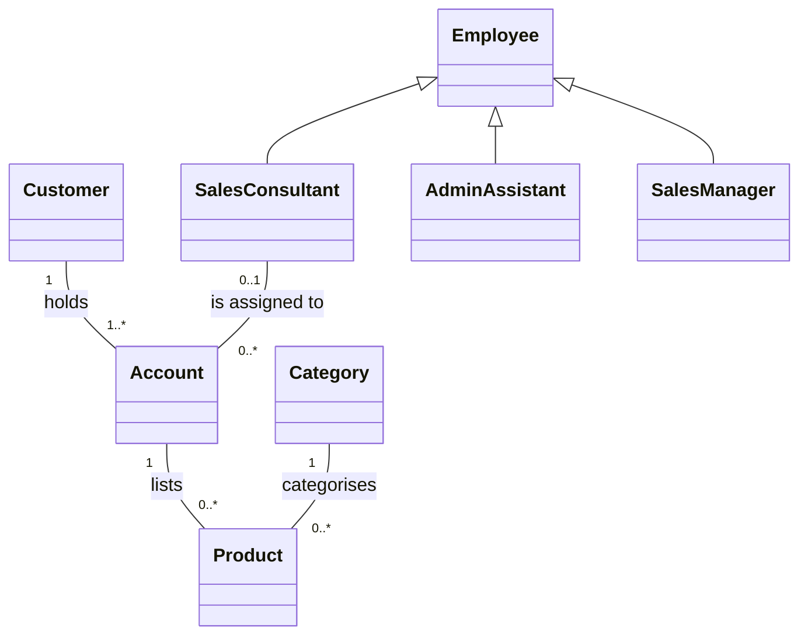

```mermaid
classDiagram
    %% ===============================================================
    %% Reciprocal Sales Corporation
    %% Domain Class Diagram — Q4.2
    %% ===============================================================

    %% Domain classes
    class Customer
    class Account
    class Product
    class Category
    class Employee
    class SalesConsultant
    class AdminAssistant
    class SalesManager

    %% ----- Associations with multiplicities -----

    %% Rule: "A customer will be allowed to open more than one account."
    Customer "1" -- "1..*" Account : holds

    %% Rule: "The customer would be allowed to list many products.
    %%        The account is allowed to idle with no product listing."
    Account "1" -- "0..*" Product : lists

    %% Rule: "Products belong to certain categories or are categorised."
    Category "1" -- "0..*" Product : categorises

    %% Rule: "The Sales consultant would be assigned to many customer
    %%        accounts. Lastly, the account is allowed to idle with no
    %%        Sales consultant assigned to it."
    SalesConsultant "0..1" -- "0..*" Account : is assigned to

    %% ----- Generalisation (inheritance) -----
    %% Rule: "All Sales consultants, Admin assistants and Sales managers
    %%        are all permanent employees... stored in one table."
    Employee <|-- SalesConsultant
    Employee <|-- AdminAssistant
    Employee <|-- SalesManager
```