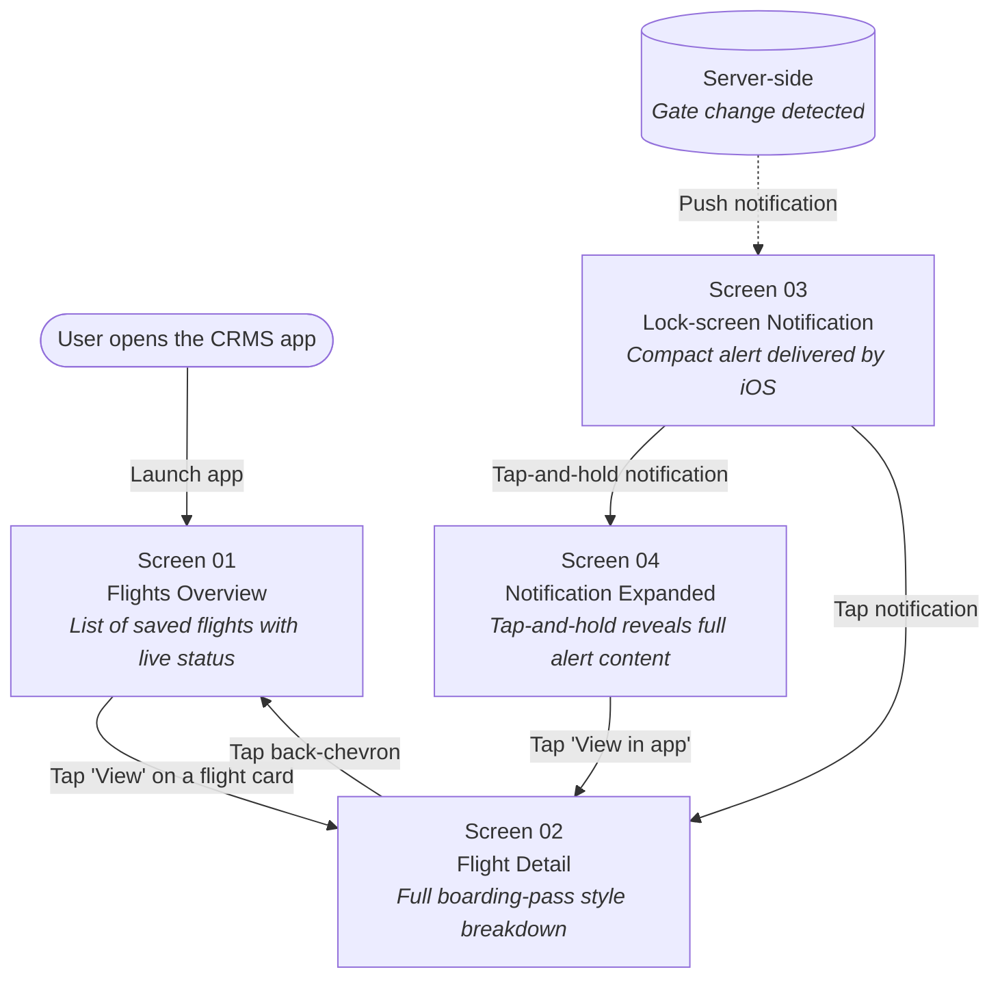

```mermaid
flowchart TD

%% ====================================================
%% Airport Customer Relationship Management System
%% Application Flow Diagram - Q3.2
%% ====================================================

%% ---------- ENTRY POINT ----------
Start([User opens the CRMS app]):::entry


%% ---------- IN-APP SCREENS ----------
Overview["Screen 01<br/>Flights Overview<br/><i>List of saved flights with live status</i>"]:::screen

Detail["Screen 02<br/>Flight Detail<br/><i>Full boarding-pass style breakdown</i>"]:::screen


%% ---------- SYSTEM-LEVEL TOUCHPOINTS ----------
Lock["Screen 03<br/>Lock-screen Notification<br/><i>Compact alert delivered by iOS</i>"]:::system

LockExpanded["Screen 04<br/>Notification Expanded<br/><i>Tap-and-hold reveals full alert content</i>"]:::system


%% ---------- USER ACTIONS ----------
Start -->|Launch app| Overview
Overview -->|Tap 'View' on a flight card| Detail
Detail -->|Tap back-chevron| Overview

%% Asynchronous server-pushed event - boarding gate change
Server[(Server-side<br/><i>Gate change detected</i>)]:::server
Server -.->|Push notification| Lock
Lock -->|Tap-and-hold notification| LockExpanded
LockExpanded -->|Tap 'View in app'| Detail
Lock -->|Tap notification| Detail

```